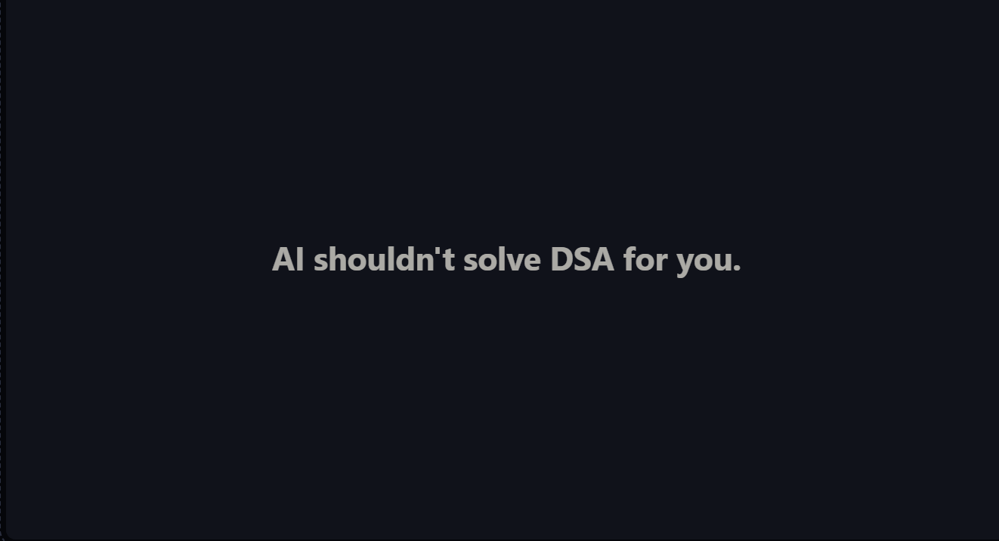

<p align="center">
  
</p>

<h1 align="center">Think Before Code</h1>

<p align="center">
  <strong>Featuring Quackrates — your mildly disappointed Socratic debugging duck.</strong>
</p>

<p align="center">
  A Socratic DSA tutor that protects productive struggle instead of handing you the answer.
</p>

## Why this exists

AI assistants are optimized to be helpful. When a learner gets stuck,
that often means receiving the optimal approach, complete code,
complexity analysis, and a polished dry run before they have had a real
chance to reason.

That feels productive. Usually, it is not.

`think-before-code` interrupts that behavior on purpose. It asks one
focused question at a time, reveals only the smallest useful hint,
requires manual reasoning, and treats getting stuck as part of the
learning process rather than something to bypass.

## Watch Quackrates refuse to spoil the solution

Instead of solving the problem for you,
Quackrates asks one question at a time until **you** discover the idea.

[](https://far-200.github.io/think-before-code/demo/)

## Core principles

- **Ask before telling.** The tutor first inspects what you already
  understand and what you have attempted.
- **One hint at a time.** Hints never stack. Each response gives only
  the smallest nudge that could move you forward.
- **Productive struggle is protected.** A concrete wrong attempt is more
  valuable than passive agreement with a finished solution.
- **Reasoning before code.** Complete code is withheld until you can
  explain the algorithm, dry-run it, and attempt implementation.
- **Dry runs before confirmation.** An approach is not treated as
  correct until you can trace it on a real input.
- **Verification before praise.** Fluent terminology is not enough; the
  reasoning must survive questions and variations.
- **Root-cause mistake logging.** Mistakes are recorded only when the
  learner can explain the belief or gap that caused them.
- **Transfer through cousin problems.** Once a pattern clicks, the tutor
  points you toward one structurally similar problem.

## How the tutoring flow works

A session generally moves through:

1. Understand the problem — a deeper pass lives in `problem-decoder`
2. Build a brute-force model
3. Explore concrete examples
4. Discover the pattern or invariant
5. Construct the algorithm
6. Dry-run it manually — the full methodology lives in `dry-run-coach`
7. Attempt implementation
8. Debug without replacing the learner's code — the full
   bug-isolation pipeline lives in `debug-coach`
9. Verify correctness and complexity — a complexity-only deep dive
   lives in `complexity-coach`
10. Transfer the idea to a cousin problem

The tutor may move backward when an explanation sounds stronger than
the learner's actual understanding.

## Quick start

1. **Clone the repository:**

   ```bash
   git clone https://github.com/Far-200/think-before-code.git
   cd think-before-code
   ```

2. **Choose a skill.** The core skill lives at
   [`skills/dsa-tutor/SKILL.md`](./skills/dsa-tutor/SKILL.md). Five
   complementary skills live alongside it — see
   [Skills in this repository](#skills-in-this-repository) below.

3. **Copy it where your agent looks for skills.** `skills/` in this
   repository is the canonical source; copy or symlink the specific
   skill directory you want into your tool's discovery directory —
   see [Installation](#installation) below for the common paths.

4. **Invoke it naturally.** Start a session by sharing the problem
   statement, what you currently understand, what you have tried, and
   where your reasoning breaks. For example:

   ```text
   Help me solve this problem, but do not give me the solution.
   Ask me one question at a time and make me explain my reasoning.
   ```

5. **Know what to expect.** One focused question per response, no
   stacked hints, no complete code until you've done the reasoning —
   see [What dsa-tutor will not do](#what-dsa-tutor-will-not-do) and
   [What dsa-tutor can do](#what-dsa-tutor-can-do) below.

A wrong attempt is useful. A copied answer wearing formal language is
less useful.

## Installation

`skills/` in this repository is the canonical source directory. Each
subdirectory is a self-contained
[Agent Skill](#skills-in-this-repository): a folder named after the
skill, containing one `SKILL.md` with `name` and `description`
frontmatter that tells a compatible agent when to use it.

To use a skill, copy (or symlink) its directory into the discovery
path your tool expects. The exact path — and whether it's a
per-project or per-user location — depends on the tool, its version,
and its configuration; the following are the common conventions at
the time of writing:

```text
Claude Code project
.claude/skills/<skill-name>/SKILL.md

Claude Code personal
~/.claude/skills/<skill-name>/SKILL.md

GitHub Copilot / VS Code project
.github/skills/<skill-name>/SKILL.md
.claude/skills/<skill-name>/SKILL.md
.agents/skills/<skill-name>/SKILL.md

Codex project
.agents/skills/<skill-name>/SKILL.md

Codex personal
~/.agents/skills/<skill-name>/SKILL.md
```

This repository doesn't try to claim universal support — exact
support may depend on the tool version and configuration, so check
your specific tool's current documentation for its skill-discovery
path before assuming one of the above is correct for your setup.

The examples below assume you're running the command from the root of
this cloned repository (`think-before-code/`), so the source path is
just `skills/dsa-tutor`, not `think-before-code/skills/dsa-tutor`.

### Bash — personal Claude Code installation

```bash
mkdir -p ~/.claude/skills
cp -R skills/dsa-tutor ~/.claude/skills/dsa-tutor
```

### PowerShell — personal Claude Code installation

```powershell
New-Item -ItemType Directory -Force "$HOME\.claude\skills" | Out-Null
Copy-Item -Recurse -Force ".\skills\dsa-tutor" "$HOME\.claude\skills\dsa-tutor"
```

A symlink keeps the copy in sync with this repository instead, which
is convenient while iterating on a skill locally:

```bash
mkdir -p ~/.claude/skills
ln -s "$(pwd)/skills/dsa-tutor" ~/.claude/skills/dsa-tutor
```

On Windows, symbolic links may require Developer Mode or elevated
permissions, so copying (the PowerShell example above) is the
simpler default there rather than a symlink.

If your tool doesn't use a `skills/` discovery directory at all,
you can usually paste the contents of a `SKILL.md` directly into a
custom-instructions, project-instructions, or system-prompt field
instead — the file is written to work as plain instructions either
way.

## Skills in this repository

Each skill is a self-contained directory under `skills/`, following
the standard Agent Skills format: a directory named after the skill,
containing a single `SKILL.md` with frontmatter (`name`,
`description`) that tells an agent when to use it.

| Skill                                                    | Use it when                                                                                                                                                       |
| -------------------------------------------------------- | ----------------------------------------------------------------------------------------------------------------------------------------------------------------- |
| [`dsa-tutor`](./skills/dsa-tutor/SKILL.md)               | You want the full Socratic walkthrough of a DSA problem, start to finish, with hints released one at a time.                                                      |
| [`problem-decoder`](./skills/problem-decoder/SKILL.md)   | You have a raw problem statement and need to pin down inputs, outputs, constraints, and edge cases before solving anything.                                       |
| [`dry-run-coach`](./skills/dry-run-coach/SKILL.md)       | You already have an approach and need to manually trace it on a concrete input to verify or debug it.                                                             |
| [`complexity-coach`](./skills/complexity-coach/SKILL.md) | You have working code or an approach and need to derive, not recall, its time and space complexity.                                                               |
| [`mock-interviewer`](./skills/mock-interviewer/SKILL.md) | You want timed, realistic interview practice, with minimal hints during the attempt and feedback only at the end.                                                 |
| [`debug-coach`](./skills/debug-coach/SKILL.md)           | You already have code with an observed failure and need the bug isolated — expected vs. actual, first divergence, smallest repair — without a rewritten function. |

These are complementary, not redundant. `dsa-tutor` is the default,
full-session skill. The other four learning skills are narrower,
standalone drills for a single stage of the process, meant to be used
on their own or as a deeper follow-up when one stage of a `dsa-tutor`
session needs more than a single question. `mock-interviewer`
intentionally runs the opposite interaction mode — scarce hints
during the attempt, full feedback only afterward — rather than
protecting productive struggle throughout, and should not be blended
with `dsa-tutor` in the same session.

## Recommended learner prompt

```text
I want to solve this problem myself.

Give me one hint at a time. Do not reveal the full approach or complete
code until I have explained the algorithm in my own words, dry-run it
manually, and attempted an implementation.

Problem:
[paste the problem]

My attempt:
[paste your reasoning or code]
```

## Example interaction

> **You:** Solve Two Sum for me.
>
> **Tutor:** Walk me through the most direct way to check whether any
> pair reaches the target. What would its time cost be?
>
> **You:** I would check every pair, so it would be O(n²).
>
> **Tutor:** While scanning the array once, what information from
> earlier positions would be useful to remember?

What did not happen: no hash map was named immediately, no code
appeared, and no finished explanation replaced the learner's reasoning.

## Mistake logs

Mistakes are classified by root cause rather than surface symptom:

- `reasoning-error` — the logic itself was wrong
- `pattern-recognition-error` — the wrong problem-solving pattern was
  chosen
- `implementation-error` — the idea was correct, but the code did not
  express it correctly
- `reading-error` — the problem or constraints were misread
- `math-error` — arithmetic or complexity reasoning was incorrect
- `off-by-one`
- `state-tracking-error` — the meaning of a variable, pointer, or state
  was lost

A mistake is logged only when the learner can explain why they made the
decision.

Typos, fatigue, accidental omissions, and isolated syntax slips are not
automatically meaningful learning entries.

Confirmed entries accumulate in [`mistake-logs/`](./mistake-logs/README.md),
which currently starts empty. This assumes the AI tool has write
access to the repository. If it doesn't, the tutor should return a
ready-to-paste entry instead of pretending to have saved one.

Template:

```markdown
## Mistake — [pattern name] — [category]

**What happened:**
[what you actually did, not what you should have done]

**Why:**
[the belief or gap that caused it, in your own words]

**Antidote:**
[a concrete check-in question to ask before the moment you are likely
to repeat this, phrased so it is answerable in one line]
```

## What dsa-tutor will not do

- Dump a complete solution immediately
- Provide complete code before the reasoning process is ready
- Stack multiple hints in one response
- Accept a polished explanation without testing understanding
- Invent a root cause for a mistake
- Praise incorrect reasoning because it sounds confident
- Replace productive struggle with near-complete pseudocode disguised
  as a hint

`mock-interviewer` is an intentional exception to some of these —
see [Skills in this repository](#skills-in-this-repository).

## What dsa-tutor can do

- Help decompose unfamiliar problems
- Challenge assumptions
- Help identify invariants and state
- Review learner-written code
- Isolate bugs without rewriting the entire solution
- Help analyze time and space complexity
- Test understanding with small variations
- Generate one structurally similar cousin problem
- Maintain a meaningful mistake log

Complete code is not forbidden forever. It becomes appropriate after
the learner has completed the reasoning process and explicitly requests
a reference implementation.

## Repository structure

```text
think-before-code/
├── .github/
│   └── workflows/
│       └── validate-skills.yml
├── evals/
│   ├── README.md
│   ├── activation-prompts.csv
│   └── behavior-cases.md
├── examples/
│   └── tutoring-session.md
├── mistake-logs/
│   └── README.md
├── public/
│   └── logo.png
├── scripts/
│   └── validate_skills.py
├── skills/
│   ├── complexity-coach/
│   │   └── SKILL.md
│   ├── debug-coach/
│   │   └── SKILL.md
│   ├── dry-run-coach/
│   │   └── SKILL.md
│   ├── dsa-tutor/
│   │   └── SKILL.md
│   ├── mock-interviewer/
│   │   └── SKILL.md
│   └── problem-decoder/
│       └── SKILL.md
├── .gitignore
├── CHANGELOG.md
├── LICENSE
└── README.md
```

- [`.github/workflows/validate-skills.yml`](./.github/workflows/validate-skills.yml) —
  CI that runs the structural validator and a CSV sanity check on
  pushes and pull requests
- [`evals/`](./evals/) — activation and behavior specifications for
  every skill; see [Testing and validation](#testing-and-validation)
- [`examples/tutoring-session.md`](./examples/tutoring-session.md) —
  a complete, realistic `dsa-tutor` transcript from problem statement
  to a cousin problem
- [`mistake-logs/README.md`](./mistake-logs/README.md) — where
  learner-confirmed mistake-log entries accumulate; currently empty,
  see Roadmap
- [`public/logo.png`](./public/logo.png) — Quackrates, the project mascot
- [`scripts/validate_skills.py`](./scripts/validate_skills.py) — the
  structural validator; see
  [Testing and validation](#testing-and-validation)
- [`skills/`](./skills/) — one self-contained Agent Skill per
  directory, each with its own `SKILL.md`; see
  [Skills in this repository](#skills-in-this-repository)
- [`.gitignore`](./.gitignore) — files Git should ignore
- [`CHANGELOG.md`](./CHANGELOG.md) — notable changes per version
- [`LICENSE`](./LICENSE) — repository license
- `README.md` — project overview and usage guide

## Testing and validation

Two things protect the repository's structure and behavior:

- **`scripts/validate_skills.py`** checks that every skill under
  `skills/` has a `SKILL.md` with valid frontmatter, that its `name`
  matches its directory and uses lowercase letters, digits, and
  hyphens, that no two skills share a name, that no obsolete flat
  `skills/*.md` files exist, that all expected skill directories are
  present, that files are valid UTF-8, and that relative Markdown
  links across the repository resolve. Run it locally with:

  ```bash
  python scripts/validate_skills.py
  ```

- **`.github/workflows/validate-skills.yml`** runs that same script,
  plus a basic parse check on `evals/activation-prompts.csv`, on every
  push and pull request.

- **`evals/`** documents, per skill, which prompts should and
  shouldn't activate it (`activation-prompts.csv`) and what behavior
  is expected or forbidden once it has (`behavior-cases.md`). This is
  currently a human-readable specification, not an automated grader —
  see [`evals/README.md`](./evals/README.md) for exactly what that
  means today and what a future automated runner could do with it.

## Release

The current release is `v1.1.0`. See
[`CHANGELOG.md`](./CHANGELOG.md) for the complete release notes.

## Roadmap

### Completed

- [x] Package each skill in the Agent Skills directory format
- [x] Add the core Socratic DSA tutor
- [x] Add problem-statement decoding
- [x] Add manual dry-run coaching
- [x] Add complexity-analysis coaching
- [x] Add realistic mock-interview mode
- [x] Add learner-confirmed mistake logging
- [x] Add a debug-without-rewriting skill (`debug-coach`)
- [x] Add a complete example tutoring transcript
- [x] Add activation and behavior eval specifications
- [x] Add structural validation for skill packaging (script + CI)
- [x] Add cross-agent installation guidance

### Next

- [ ] Add learner-confirmed mistake-log samples (`mistake-logs/` is
      still empty — real sessions need to produce these)
- [ ] Expand the example transcript collection beyond one session
- [ ] Add cross-agent installation helper scripts, not just
      documented paths
- [ ] Add automated behavior eval execution — `evals/` is currently a
      specification, not a runner
- [ ] Add session-state templates for unfinished problems
- [ ] Add progress tracking across patterns
- [ ] Add spaced-revision prompts and cousin-problem mappings beyond
      the single suggestion given at the end of a session
- [ ] Document integrations with additional AI tools and IDEs beyond
      the initial three covered in Installation

## Contributing

Contributions are welcome, especially those that:

- improve tutoring behavior,
- add high-quality example sessions,
- expand cousin-problem mappings,
- improve mistake classification,
- or identify places where the tutor reveals too much too early.

Every contribution should preserve the central rule:

> **One hint at a time. Think before code.**

## License

This project is licensed under the MIT License. See
[`LICENSE`](./LICENSE) for details.

---

_The goal was never to become good at reading solutions. It was to
become good at finding them._
