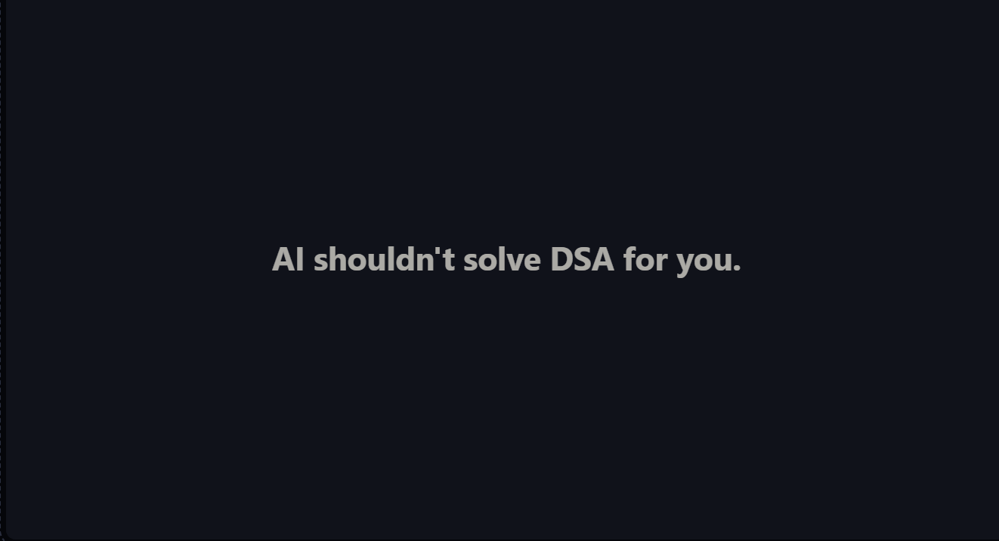

<p align="center">
  
</p>

<h1 align="center">Think Before Code</h1>

<p align="center">
  <strong>Featuring Quackrates — your mildly disappointed Socratic coaching duck.</strong>
</p>

<p align="center">
  A portable suite of Socratic Agent Skills for learning DSA and practicing software-engineering judgment — protecting productive struggle instead of handing you the answer. Not a hosted app: copy a skill into a compatible agent, or paste it as project instructions.
</p>

<p align="center">
  <strong>
    <a href="https://far-200.github.io/think-before-code/find-your-coach/">Not sure where to start? Find your coach →</a>
  </strong>
</p>

## Why this exists

AI assistants are optimized to be helpful. When a learner gets stuck,
that often means receiving the optimal approach, complete code,
complexity analysis, and a polished dry run before they have had a real
chance to reason.

That feels productive. Usually, it is not.

The same failure mode shows up on both sides of implementation.
Before it, an agent handed a vague request infers the missing
requirements and starts coding against a product nobody specified.
After it, an agent asked to review dumps every finding at once — or
quietly rewrites the file — before the learner has noticed a single
risk themselves. The work gets done; the specification judgment and
the review judgment never form.

`think-before-code` interrupts that behavior on purpose. It asks one
focused question at a time, reveals only the smallest useful hint,
requires manual reasoning, and treats getting stuck as part of the
learning process rather than something to bypass.

## Same prompt. Different behaviour.

A default assistant dumps the artifact — the solution, the findings,
the specification. Quackrates makes the learner author the reasoning.

[](https://far-200.github.io/think-before-code/demo/)

## Core principles

- **Ask before telling.** The tutor first inspects what you already
  understand and what you have attempted.
- **One hint at a time.** Hints never stack. Each response gives only
  the smallest nudge that could move you forward.
- **Productive struggle is protected.** A concrete wrong attempt is more
  valuable than passive agreement with a finished solution.
- **Reasoning before code.** Complete code is withheld until you can
  explain the algorithm, dry-run it, and attempt implementation.
- **Dry runs before confirmation.** An approach is not treated as
  correct until you can trace it on a real input.
- **Verification before praise.** Fluent terminology is not enough; the
  reasoning must survive questions and variations.
- **Root-cause mistake logging.** Mistakes are recorded only when the
  learner can explain the belief or gap that caused them.
- **Transfer through cousin problems.** Once a pattern clicks, the tutor
  points you toward one structurally similar problem.

## How the DSA tutoring flow works

The full DSA learning lifecycle the suite covers looks like this:

1. Decode the problem — a deeper pass lives in `problem-decoder`
2. Build and examine an approach — brute force first, then the
   pattern or invariant, then the algorithm
3. Dry-run it manually — the full methodology lives in
   `dry-run-coach`
4. Attempt implementation
5. Debug concrete failures without replacing the learner's code —
   the full bug-isolation pipeline lives in `debug-coach`
6. Verify correctness and complexity — a complexity-only deep dive
   lives in `complexity-coach`
7. Design a compact, justified test suite — the full methodology
   lives in `test-case-coach`
8. Transfer the learned structure — `dsa-tutor` closes with one
   cousin problem; the full abstraction-and-transfer protocol lives
   in `pattern-transfer-coach`

`dsa-tutor` coordinates the core learning path one question at a time
and can hand off when one stage deserves a dedicated specialist
session. No session is required to invoke every specialist, and most
won't. The tutor may also move backward when an explanation sounds
stronger than the learner's actual understanding.

## Beyond DSA: before and after implementation

Two skills sit outside the DSA lifecycle entirely, on either side of
the code being written:

```text
vague request
    ↓
specification-coach
    ↓
implementation
    ↓
code-review-coach
```

`specification-coach` runs **before** implementation. Bring a vague
feature request, issue, or change request, and it resolves one
ambiguity at a time until observable behaviour, scope, non-goals,
constraints, failure behaviour, and acceptance criteria are all
decisions _you_ made — ending in a specification an implementation
agent can act on. It never invents requirements and never writes the
code.

```text
Here's the feature request. Help me define it well enough to verify
before I hand it to an agent — one question at a time, and don't
write the spec for me.
```

`code-review-coach` runs **after** code exists. Bring a diff or a
pull request, and it helps you discover and justify findings one
concern at a time: contract first, evidence before impact, impact
before severity, the smallest justified change, and a verification
idea — ending in a prioritized review summary in your own words.
Design patterns are never prescribed up front; the design pressure
has to be identified first, and "no pattern is justified" is a valid
conclusion.

```text
Here's the code / diff and what it's supposed to do. Help me review
it myself, one concern at a time. Don't list the findings or rewrite
anything — ask me questions until I find and justify them.
```

Both hand off like the DSA skills do: a concrete observed failure
goes to `debug-coach`, a systematic suite goes to `test-case-coach`,
and a complexity-only question goes to `complexity-coach`.

## Quick start

1. **Clone the repository:**

   ```bash
   git clone https://github.com/mahkameh13/think-before-code.git
   cd think-before-code
   ```

2. **Choose a skill.** If you're not sure which one fits where you
   are, answer a short series of questions in
   [Find Your Coach](https://far-200.github.io/think-before-code/find-your-coach/)
   and it will name one, with a starter prompt to paste. Otherwise:
   the core skill lives at
   [`skills/dsa-tutor/SKILL.md`](./skills/dsa-tutor/SKILL.md). Twelve
   more skills live alongside it, thirteen in total — see
   [Which skill should I use?](#which-skill-should-i-use) for the same
   routing in text, and
   [Skills in this repository](#skills-in-this-repository) for the
   full table.

3. **Copy it where your agent looks for skills.** `skills/` in this
   repository is the canonical source; copy or symlink the specific
   skill directory you want into your tool's discovery directory —
   see [Installation](#installation) below for the common paths.

4. **Invoke it naturally.** Start a session by sharing the problem
   statement, what you currently understand, what you have tried, and
   where your reasoning breaks. For example:

   ```text
   Help me solve this problem, but do not give me the solution.
   Ask me one question at a time and make me explain my reasoning.
   ```

5. **Know what to expect.** One focused question per response, no
   stacked hints, no complete code until you've done the reasoning —
   see [What dsa-tutor will not do](#what-dsa-tutor-will-not-do) and
   [What dsa-tutor can do](#what-dsa-tutor-can-do) below.

A wrong attempt is useful. A copied answer wearing formal language is
less useful.

## Which skill should I use?

Match where you actually are, not where you'd like to be.
[Find Your Coach](https://far-200.github.io/think-before-code/find-your-coach/)
asks these same questions one at a time; the list below is the same
routing in text, and it keeps working without JavaScript:

- **Want a general coding learning partner for a concept, course,
  architecture topic, or interview-prep pattern** → `think-before-code`
- **Unsolved problem, want to learn it end to end** → `dsa-tutor`
  (the default; when in doubt, start here)
- **Have a vague feature, issue, or change request and need to
  define it before an agent codes** → `specification-coach`
- **Haven't even understood the statement yet** → `problem-decoder`
- **Have an approach, want to trace it on one concrete input** →
  `dry-run-coach`
- **Have code, and it's observably doing the wrong thing** →
  `debug-coach`
- **Have working code, want its Big-O derived, not recalled** →
  `complexity-coach`
- **Have an approach or implementation, want a real test suite** →
  `test-case-coach`
- **Solved it, want the reusable pattern out of it** →
  `pattern-transfer-coach`
- **Want timed interview pressure instead of coaching** →
  `mock-interviewer`
- **Have existing non-DSA code or a PR, want to practise reviewing
  it yourself, one concern at a time** → `code-review-coach`

## Installation

`skills/` in this repository is the canonical source directory. Each
subdirectory is a self-contained
[Agent Skill](#skills-in-this-repository): a folder named after the
skill, containing one `SKILL.md` with `name` and `description`
frontmatter that tells a compatible agent when to use it.

To use a skill, copy (or symlink) its directory into the discovery
path your tool expects. The exact path — and whether it's a
per-project or per-user location — depends on the tool, its version,
and its configuration; the following are the common conventions at
the time of writing:

```text
Claude Code project
.claude/skills/<skill-name>/SKILL.md

Claude Code personal
~/.claude/skills/<skill-name>/SKILL.md

GitHub Copilot / VS Code project
.github/skills/<skill-name>/SKILL.md
.claude/skills/<skill-name>/SKILL.md
.agents/skills/<skill-name>/SKILL.md

GitHub Copilot personal
~/.copilot/skills/<skill-name>/SKILL.md
~/.agents/skills/<skill-name>/SKILL.md

Codex project
.agents/skills/<skill-name>/SKILL.md

Codex personal
~/.agents/skills/<skill-name>/SKILL.md
```

This repository doesn't try to claim universal support — exact
support may depend on the tool version and configuration, so check
your specific tool's current documentation for its skill-discovery
path before assuming one of the above is correct for your setup.

The examples below assume you're running the command from the root of
this cloned repository (`think-before-code/`), so the source path is
just `skills/dsa-tutor`, not `think-before-code/skills/dsa-tutor`.

### Bash — personal Claude Code installation

```bash
mkdir -p ~/.claude/skills
cp -R skills/dsa-tutor ~/.claude/skills/dsa-tutor
```

### PowerShell — personal Claude Code installation

```powershell
New-Item -ItemType Directory -Force "$HOME\.claude\skills" | Out-Null
Copy-Item -Recurse -Force ".\skills\dsa-tutor" "$HOME\.claude\skills\dsa-tutor"
```

A symlink keeps the copy in sync with this repository instead, which
is convenient while iterating on a skill locally:

```bash
mkdir -p ~/.claude/skills
ln -s "$(pwd)/skills/dsa-tutor" ~/.claude/skills/dsa-tutor
```

On Windows, symbolic links may require Developer Mode or elevated
permissions, so copying (the PowerShell example above) is the
simpler default there rather than a symlink.

### GitHub CLI (`gh skill`, public preview)

If you use GitHub Copilot, GitHub CLI can install a skill straight
from this repository instead of you copying directories by hand.
GitHub documents `gh skill` as a public preview that is subject to
change, and it requires GitHub CLI 2.90.0 or later, so treat this as
a convenience rather than the supported path:

```bash
gh skill preview Far-200/think-before-code dsa-tutor
gh skill install Far-200/think-before-code dsa-tutor
```

`preview` renders a skill's `SKILL.md` and file tree in your terminal
without installing anything. GitHub's own guidance is to inspect a
skill this way before installing it, since skills are not verified by
GitHub — that applies to this repository as much as any other. By
default `gh skill install` installs for Copilot at project scope;
`--agent` and `--scope` change that. Note that installing this way
writes provenance metadata into the installed copy's frontmatter, so
an installed `SKILL.md` won't be byte-identical to the one in
`skills/`.

If your tool doesn't use a `skills/` discovery directory at all,
you can usually paste the contents of a `SKILL.md` directly into a
custom-instructions, project-instructions, or system-prompt field
instead — the file is written to work as plain instructions either
way.

## Skills in this repository

Each skill is a self-contained directory under `skills/`, following
the standard Agent Skills format: a directory named after the skill,
containing a single `SKILL.md` with frontmatter (`name`,
`description`) that tells an agent when to use it.

| Skill                                                                | Use it when                                                                                                                                                                                                                                                                                   |
| -------------------------------------------------------------------- | --------------------------------------------------------------------------------------------------------------------------------------------------------------------------------------------------------------------------------------------------------------------------------------------- |
| [`dsa-tutor`](./skills/dsa-tutor/SKILL.md)                           | You want the full Socratic walkthrough of a DSA problem, start to finish, with hints released one at a time.                                                                                                                                                                                  |
| [`problem-decoder`](./skills/problem-decoder/SKILL.md)               | You have a raw problem statement and need to pin down inputs, outputs, constraints, and edge cases before solving anything.                                                                                                                                                                   |
| [`dry-run-coach`](./skills/dry-run-coach/SKILL.md)                   | You already have an approach and need to manually trace it on a concrete input to verify or debug it.                                                                                                                                                                                         |
| [`complexity-coach`](./skills/complexity-coach/SKILL.md)             | You have working code or an approach and need to derive, not recall, its time and space complexity.                                                                                                                                                                                           |
| [`mock-interviewer`](./skills/mock-interviewer/SKILL.md)             | You want timed, realistic interview practice, with minimal hints during the attempt and feedback only at the end.                                                                                                                                                                             |
| [`debug-coach`](./skills/debug-coach/SKILL.md)                       | You already have code with an observed failure and need the bug isolated — expected vs. actual, first divergence, smallest repair — without a rewritten function.                                                                                                                             |
| [`test-case-coach`](./skills/test-case-coach/SKILL.md)               | You already have an approach or implementation and want to design a compact, justified test suite — boundaries, adversarial inputs, expected outputs — yourself, one dimension at a time.                                                                                                     |
| [`pattern-transfer-coach`](./skills/pattern-transfer-coach/SKILL.md) | You've solved a problem and want to turn it into a transferable pattern — strip the story, name recognition and rule-out signals, and adapt it to exactly one cousin problem.                                                                                                                 |
| [`specification-coach`](./skills/specification-coach/SKILL.md)       | You have a vague feature request, issue, or change request and need observable behaviour, scope, non-goals, constraints, failure behaviour, and acceptance criteria defined — a learner-authored implementation handoff, with no invented requirements and no implementation written for you. |
| [`code-review-coach`](./skills/code-review-coach/SKILL.md)           | You have existing code, a diff, or a PR — not necessarily DSA — and want to practise discovering and justifying review findings yourself, one concern at a time, without a dumped list or a rewrite.                                                                                          |
| [`think-before-code`](./skills/think-before-code/SKILL.md)           | You want a general Socratic coding learning partner for programming concepts, coursework, architecture, or interview preparation when none of the narrower workflows is a better fit.                                                                                                       |
| [`learn-codebase-coach`](./skills/learn-codebase-coach/SKILL.md)       | You want to understand an unfamiliar repository or learn by implementing a real change while retaining ownership of the reasoning and code.                                                                                                                                                 |
| [`learn-by-googling`](./skills/learn-by-googling/SKILL.md)             | You want to learn a technical topic by searching, evaluating, comparing, and synthesizing primary web sources instead of receiving an unsupported explanation.                                                                                                                              |

These are complementary, not redundant. `dsa-tutor` is the default
skill that coordinates a complete DSA learning session. Six
specialist skills are narrower, standalone drills that each deepen
one stage of that lifecycle, meant to be used on their own or as a
follow-up when one stage of a `dsa-tutor` session needs more than a
single question. `specification-coach` and `code-review-coach` stand apart from that
lifecycle: they are separate software-engineering entry points on
either side of implementation — defining behaviour before code
exists, and building review judgment once it does — see
[Beyond DSA](#beyond-dsa-before-and-after-implementation). Both share
the suite's one-question-at-a-time discipline and hand off to
`debug-coach`, `test-case-coach`, and `complexity-coach` at the same
boundaries. `mock-interviewer` intentionally runs the opposite
interaction mode — scarce hints during the attempt, full feedback
only afterward — rather than protecting productive struggle
throughout, and should not be blended with the coaching skills in the
same session.

`learn-codebase-coach` is the repository-learning entry point: it combines Socratic exploration with learner-led implementation of a real artifact. `learn-by-googling` is the source-driven research entry point: it makes the learner search, assess evidence, and synthesize a technical model from cited sources.

`think-before-code` is the general entry point for learning requests
that do not begin in one of those narrower workflows: concepts,
coursework, architecture, syntax, or interview-prep mental models. It
uses the same learner-authored, no-ready-made-solution posture while
letting a specialist skill take precedence when the task is clearly a
debugging, test-design, review, specification, complexity, or DSA
session.

## Recommended learner prompt

```text
I want to solve this problem myself.

Give me one hint at a time. Do not reveal the full approach or complete
code until I have explained the algorithm in my own words, dry-run it
manually, and attempted an implementation.

Problem:
[paste the problem]

My attempt:
[paste your reasoning or code]
```

## Example interaction

> **You:** Solve Two Sum for me.
>
> **Tutor:** Walk me through the most direct way to check whether any
> pair reaches the target. What would its time cost be?
>
> **You:** I would check every pair, so it would be O(n²).
>
> **Tutor:** While scanning the array once, what information from
> earlier positions would be useful to remember?

What did not happen: no hash map was named immediately, no code
appeared, and no finished explanation replaced the learner's reasoning.

## Mistake logs

Mistakes are classified by root cause rather than surface symptom:

- `reasoning-error` — the logic itself was wrong
- `pattern-recognition-error` — the wrong problem-solving pattern was
  chosen
- `implementation-error` — the idea was correct, but the code did not
  express it correctly
- `reading-error` — the problem or constraints were misread
- `math-error` — arithmetic or complexity reasoning was incorrect
- `off-by-one`
- `state-tracking-error` — the meaning of a variable, pointer, or state
  was lost

A mistake is logged only when the learner can explain why they made the
decision.

Typos, fatigue, accidental omissions, and isolated syntax slips are not
automatically meaningful learning entries.

Confirmed entries accumulate in [`mistake-logs/`](./mistake-logs/README.md),
which currently starts empty. This assumes the AI tool has write
access to the repository. If it doesn't, the tutor should return a
ready-to-paste entry instead of pretending to have saved one.

Template:

```markdown
## Mistake — [pattern name] — [category]

**What happened:**
[what you actually did, not what you should have done]

**Why:**
[the belief or gap that caused it, in your own words]

**Antidote:**
[a concrete check-in question to ask before the moment you are likely
to repeat this, phrased so it is answerable in one line]
```

## Session continuity

> Stop the session, not the reasoning.

Eight of the thirteen skills can generate a **Resume
Pack**: a portable Markdown checkpoint for an unfinished session, on
explicit request ("save where we are," "give me something I can paste
tomorrow," "I need to continue this in another chat").

A Resume Pack is not hidden persistent memory. Nothing in this
repository stores or retrieves one automatically — the learner carries
it themselves, typically by copying the Markdown into a new chat,
agent, or context window. It preserves what the learner actually
established, clearly separated from hypotheses, hints already given,
and unresolved questions — and it never uses the act of summarizing as
an excuse to advance the solution: no completed algorithm, no named
pattern the learner hasn't found, no invented invariant or root cause,
no hint that hasn't actually been given yet.

To resume, paste the Resume Pack at the start of a new session with a
supporting skill. The coach orients to the recorded state instead of
re-deriving it, treats recorded hypotheses as hypotheses rather than
confirmed fact, and continues from the checkpoint's recorded next
step — one focused question at a time, at the same hint level, same as
any other session.

`think-before-code`, `mock-interviewer`, and `complexity-coach` do not
define the repository's Resume Pack protocol.

See [`session-state/README.md`](./session-state/README.md) for the
full explanation and
[`session-state/checkpoint-template.md`](./session-state/checkpoint-template.md)
for the field-by-field format, and
[`examples/session-continuity-example.md`](./examples/session-continuity-example.md)
for a complete interrupted-and-resumed transcript. Each supporting
skill's own `SKILL.md` carries the behavior directly, so a single
copied skill directory keeps working on its own.

## What dsa-tutor will not do

- Dump a complete solution immediately
- Provide complete code before the reasoning process is ready
- Stack multiple hints in one response
- Accept a polished explanation without testing understanding
- Invent a root cause for a mistake
- Praise incorrect reasoning because it sounds confident
- Replace productive struggle with near-complete pseudocode disguised
  as a hint

`mock-interviewer` is an intentional exception to some of these —
see [Skills in this repository](#skills-in-this-repository).

## What dsa-tutor can do

- Help decompose unfamiliar problems
- Challenge assumptions
- Help identify invariants and state
- Review learner-written code
- Isolate bugs without rewriting the entire solution
- Help analyze time and space complexity
- Test understanding with small variations
- Generate one structurally similar cousin problem
- Maintain a meaningful mistake log

It names testing and transfer as stages, but it doesn't contain the
specialist protocols internally — when a stage deserves a whole
session (a systematic test suite, a full transfer exercise, a deep
complexity derivation), `dsa-tutor` hands off to the matching
specialist skill rather than improvising its protocol inline.

Complete code is not forbidden forever. It becomes appropriate after
the learner has completed the reasoning process and explicitly requests
a reference implementation.

## Repository structure

```text
think-before-code/
├── .github/
│   └── workflows/
│       └── validate-skills.yml
├── demo/
│   └── index.html
├── evals/
│   ├── README.md
│   ├── activation-prompts.csv
│   ├── behavior-cases.md
│   └── finder-cases.csv
├── examples/
│   ├── code-review-session.md
│   ├── pattern-transfer-session.md
│   ├── session-continuity-example.md
│   ├── specification-session.md
│   ├── test-case-session.md
│   └── tutoring-session.md
├── find-your-coach/
│   ├── app.js
│   ├── index.html
│   ├── routes.json
│   └── styles.css
├── mistake-logs/
│   └── README.md
├── public/
│   ├── demo.gif
│   └── logo.png
├── scripts/
│   ├── validate_evals.py
│   ├── validate_finder.py
│   └── validate_skills.py
├── session-state/
│   ├── README.md
│   └── checkpoint-template.md
├── skills/
│   ├── code-review-coach/
│   │   └── SKILL.md
│   ├── complexity-coach/
│   │   └── SKILL.md
│   ├── debug-coach/
│   │   └── SKILL.md
│   ├── dry-run-coach/
│   │   └── SKILL.md
│   ├── dsa-tutor/
│   │   └── SKILL.md
│   ├── mock-interviewer/
│   │   └── SKILL.md
│   ├── learn-by-googling/
│   │   └── SKILL.md
│   ├── learn-codebase-coach/
│   │   ├── agents/
│   │   ├── references/
│   │   └── SKILL.md
│   ├── pattern-transfer-coach/
│   │   └── SKILL.md
│   ├── problem-decoder/
│   │   └── SKILL.md
│   ├── specification-coach/
│   │   └── SKILL.md
│   ├── think-before-code/
│   │   └── SKILL.md
│   └── test-case-coach/
│       └── SKILL.md
├── tests/
│   ├── test_validate_evals.py
│   ├── test_validate_finder.py
│   └── test_validate_skills.py
├── .gitignore
├── CHANGELOG.md
├── LICENSE
└── README.md
```

- [`.github/workflows/validate-skills.yml`](./.github/workflows/validate-skills.yml) —
  CI that runs the validator test suite, the structural validator,
  the evaluation-specification validator, and the finder-routing
  validator on pushes and pull requests
- [`demo/index.html`](./demo/index.html) — the page the demo GIF was
  recorded from, also hosted via GitHub Pages
- [`evals/`](./evals/) — activation and behavior specifications for
  every skill; see [Testing and validation](#testing-and-validation)
- [`examples/tutoring-session.md`](./examples/tutoring-session.md) —
  a complete, realistic `dsa-tutor` transcript from problem statement
  to a cousin problem
- [`examples/test-case-session.md`](./examples/test-case-session.md) —
  a `test-case-coach` transcript: one input dimension at a time,
  predicted outputs, an adversarial case, and a redundant case cut
- [`examples/pattern-transfer-session.md`](./examples/pattern-transfer-session.md) —
  a `pattern-transfer-coach` transcript: story stripped off a solved
  problem, a near-miss, and exactly one (unsolved) cousin problem
- [`examples/code-review-session.md`](./examples/code-review-session.md) —
  a `code-review-coach` transcript on a non-DSA pull request:
  evidence before impact, impact before severity, a declined design
  pattern, and a learner-authored prioritized review summary
- [`examples/specification-session.md`](./examples/specification-session.md) —
  a `specification-coach` transcript on a vague non-DSA feature
  request: one ambiguity at a time, a vague adjective challenged, a
  deliberate non-goal, and a learner-authored specification with an
  implementation handoff
- [`examples/session-continuity-example.md`](./examples/session-continuity-example.md) —
  a `debug-coach` session interrupted mid-trace, checkpointed into a
  Resume Pack, and resumed in a new chat from the exact unresolved
  question, with no fix or root cause smuggled into the checkpoint
- [`find-your-coach/`](./find-your-coach/) — the Find Your Coach
  page: a deterministic router that asks a short series of questions
  and names one skill. Plain HTML, CSS, and JavaScript with no build step
  and no model call; every screen and every routing decision comes
  from [`routes.json`](./find-your-coach/routes.json). Hosted via
  GitHub Pages alongside the demo
- [`mistake-logs/README.md`](./mistake-logs/README.md) — where
  learner-confirmed mistake-log entries accumulate; currently empty,
  see Roadmap
- [`public/logo.png`](./public/logo.png) — Quackrates, the project mascot
- [`public/demo.gif`](./public/demo.gif) — the demo recording embedded
  at the top of this README
- [`scripts/validate_skills.py`](./scripts/validate_skills.py) — the
  structural validator; see
  [Testing and validation](#testing-and-validation)
- [`scripts/validate_evals.py`](./scripts/validate_evals.py) — the
  evaluation-specification validator; see
  [Testing and validation](#testing-and-validation)
- [`scripts/validate_finder.py`](./scripts/validate_finder.py) — the
  finder-routing validator; see
  [Testing and validation](#testing-and-validation)
- [`session-state/README.md`](./session-state/README.md) — what a
  Resume Pack is, when to generate one, and which skills support it;
  see [Session continuity](#session-continuity)
- [`session-state/checkpoint-template.md`](./session-state/checkpoint-template.md) —
  the canonical Resume Pack field reference. Documentation, not a
  runtime dependency — each supporting skill's `SKILL.md` carries its
  own copy of the behavior
- [`skills/`](./skills/) — one self-contained Agent Skill per
  directory, each with its own `SKILL.md`; see
  [Skills in this repository](#skills-in-this-repository)
- [`tests/`](./tests/) — `unittest` coverage for all three validation
  scripts, run by CI and locally with `python -m unittest discover`
- [`.gitignore`](./.gitignore) — files Git should ignore
- [`CHANGELOG.md`](./CHANGELOG.md) — notable changes per version
- [`LICENSE`](./LICENSE) — repository license
- `README.md` — project overview and usage guide

## Testing and validation

Five layers protect the repository's structure and behavior:

- **`scripts/validate_skills.py`** checks that every skill under
  `skills/` has a `SKILL.md` with valid frontmatter, that its `name`
  matches its directory and uses lowercase letters, digits, and
  hyphens, that no two skills share a name, that no obsolete flat
  `skills/*.md` files exist, that all expected skill directories are
  present, that files are valid UTF-8, and that relative Markdown
  links across the repository resolve. Run it locally with:

  ```bash
  python scripts/validate_skills.py
  ```

- **`scripts/validate_evals.py`** checks
  `evals/activation-prompts.csv`: it must parse with the expected
  columns, IDs must be present and unique, every `target_skill` must
  be a real skill directory (or `none`), `should_activate` must be
  `true` or `false`, prompts and reasons must be non-empty — and
  every skill directory must have at least one
  `should_activate = true` row and at least one
  `should_activate = false` row, so no skill ships without both a
  positive and a negative activation case. Run it locally with:

  ```bash
  python scripts/validate_evals.py
  ```

- **`scripts/validate_finder.py`** checks the routing data behind
  [Find Your Coach](https://far-200.github.io/think-before-code/find-your-coach/):
  `find-your-coach/routes.json` must parse, its question, option, and
  result ids must be unique, every option must point at a node that
  exists, every path must terminate at a result without cycling, every
  skill result must name a real skill directory and carry a reason and
  a starter prompt, all thirteen skills must be reachable as
  recommendations, the two no-match outcomes must stay honest — no
  skill name, no starter prompt — and every relative
  `../skills/<name>/SKILL.md` link the page builds must resolve. It
  then walks every path in `evals/finder-cases.csv` through the real
  route data and fails if one lands somewhere other than its
  `expected_result`. Run it locally with:

  ```bash
  python scripts/validate_finder.py
  ```

- **`tests/`** covers all three validators with Python's built-in
  `unittest` — no third-party test framework, no network access, and
  fixtures written to temporary directories rather than the real
  repository. Run the suite from the repository root with:

  ```bash
  python -m unittest discover
  ```

- **`.github/workflows/validate-skills.yml`** runs the test suite and
  all three validators on every push and pull request. The workflow
  only orchestrates: the validation rules live in the scripts above,
  so what CI enforces is exactly what you can run locally.

- **`evals/`** documents, per skill, which prompts should and
  shouldn't activate it (`activation-prompts.csv`) and what behavior
  is expected or forbidden once it has (`behavior-cases.md`). Those
  two are currently a human-readable specification, not an automated
  grader. The third file, `finder-cases.csv`, is different: the finder
  is deterministic, so its routing cases are executed in CI rather
  than described. See [`evals/README.md`](./evals/README.md) for
  exactly what that means today and what a future automated runner
  could do with the other two.

## Release

The current release is `v1.6.0`. See
[`CHANGELOG.md`](./CHANGELOG.md) for the complete release notes.

## Roadmap

### Completed

- [x] Package each skill in the Agent Skills directory format
- [x] Add the core Socratic DSA tutor
- [x] Add problem-statement decoding
- [x] Add manual dry-run coaching
- [x] Add complexity-analysis coaching
- [x] Add realistic mock-interview mode
- [x] Add learner-confirmed mistake logging
- [x] Add a debug-without-rewriting skill (`debug-coach`)
- [x] Add a complete example tutoring transcript
- [x] Add activation and behavior eval specifications
- [x] Add structural validation for skill packaging (script + CI)
- [x] Add cross-agent installation guidance
- [x] Add a test-design coaching skill (`test-case-coach`)
- [x] Add a pattern-abstraction and transfer skill
      (`pattern-transfer-coach`)
- [x] Expand the example transcripts beyond one session (test-case
      and pattern-transfer sessions)
- [x] Expand activation and behavior coverage across the full suite,
      including cross-skill boundary cases
- [x] Strengthen eval validation — CI now requires positive and
      negative activation cases for every skill
- [x] Add the first non-DSA skill, a Socratic code-review coach
      (`code-review-coach`), with its own activation and behavior
      evals and an example session
- [x] Add a pre-implementation specification coach
      (`specification-coach`), with its own activation and behavior
      evals, reciprocal boundaries, and an example session
- [x] Extract eval validation into a locally runnable script and
      cover both validators with unit tests
- [x] Add the interactive Find Your Coach router, executable routing
      cases, validation, tests, and CI coverage
- [x] Add session-state templates and a Resume Pack checkpoint/resume
      protocol for unfinished sessions, covering eight of the thirteen
      skills (see [Session continuity](#session-continuity))

### Next

- [ ] Add learner-confirmed mistake-log samples (`mistake-logs/` is
      still empty — real sessions need to produce these)
- [ ] Add cross-agent installation helper scripts, not just
      documented paths
- [ ] Add automated behavior eval execution — `evals/` is currently a
      specification, not a runner
- [ ] Add progress tracking across patterns
- [ ] Add spaced-revision prompts, building on top of the per-session
      transfer coaching that now exists
- [ ] Build a curated cousin-problem mapping dataset —
      `pattern-transfer-coach` picks one cousin per session, but
      there's no shared, reviewed mapping of patterns to cousin and
      near-miss problems yet
- [ ] Document integrations with additional AI tools and IDEs beyond
      the initial three covered in Installation
- [ ] Validate `code-review-coach` and `specification-coach` with
      real SWE sessions and use the findings to refine their
      boundaries before adding a third broader SWE domain

## Contributing

Contributions are welcome, especially those that:

- improve tutoring behavior,
- add activation-boundary cases to `evals/` — realistic prompts where
  two skills could plausibly collide,
- add test-design scenarios and transfer exercises,
- add realistic code-review scenarios and cross-skill boundaries for
  `code-review-coach` — especially where review borders debugging,
  test design, or complexity analysis,
- add ambiguous feature requests, specification boundary cases, and
  realistic acceptance-criteria sessions — especially collisions
  between specification, review, testing, and debugging,
- add high-quality example transcripts,
- expand cousin-problem mappings,
- improve mistake classification,
- or identify places where the tutor reveals too much too early.

Every contribution should preserve the central rule:

> **One hint at a time. Think before code.**

## Provenance and third-party notices

This fork preserves the MIT notice for its Far-200/think-before-code base and records direct adaptations, authoring assistance, pinned source revisions, local modifications, and complete required license notices in [`THIRD_PARTY_NOTICES.md`](./THIRD_PARTY_NOTICES.md).

## License

This project is licensed under the MIT License. See
[`LICENSE`](./LICENSE) for details.

---

_The goal was never to become good at reading solutions. It was to
become good at finding them._
